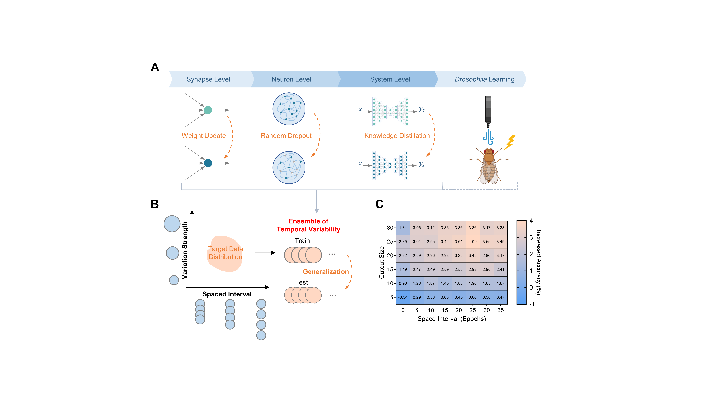

<div align="center">
  <div>
    <h1>
        Spacing effect improves generalization in biological and artificial systems
    </h1>
  </div>

  <div>
    <a href="https://github.com/SunGL001"><strong>Guanglong Sun</strong></a>*,  
    <strong>Ning Huang</strong></a>*,
    <a href="https://github.com/AnAppleCore"><strong>Hongwei Yan</strong></a>, 
    <a href="https://lywang3081.github.io/"><strong>Liyuan Wang</strong></a>#,
    <strong>Jun Zhou</strong>,
    <strong>Qian Li</strong>,
    <strong>Bo Lei</strong>,
    and <strong>Yi Zhong</strong>
  </div>

<div>
<strong>Official Code Repository for Our Paper</strong>

</div>

</div>


---

This repository contains the official PyTorch implementation for the PNAS paper: **"Spacing effect improves generalization in biological and artificial systems"**.

Our study bridges neuroscience and artificial intelligence by investigating how the "spacing effect," a well-documented phenomenon in biological learning, can enhance the generalization capabilities of artificial neural networks (ANNs). We introduce bio-inspired "spaced ensemble" strategies implemented at three levels:

1.  **Neuronal Level:** Spaced Dropout
2.  **Synaptic Level:** Spaced Exponential Moving Average (Spaced EMA / WA)
3.  **Network Level:** Spaced Online/Self Knowledge Distillation (KD)

Experiments demonstrate that these strategies significantly improve model generalization across various benchmark datasets and network architectures.

<div align="center">
<p align="center">

</p>
  [Figure 1: Overview of the spacing effect in biological and artificial systems (Image from Figure 1 of the paper)]
  <br/>
  <em>(A) Temporal ensemble strategies in ANNs at the neuronal, synaptic, and network levels, analogous to biological learning. (B) Variation strength and spaced interval jointly modulate generalization performance.</em>
</div>

---

## 🔧 Requirements

This project is built with Python 3.9 and PyTorch. We recommend creating a virtual environment using `conda`.

Install the required packages. 
- python 3.9.18
- torch 2.4.1+cu121
- torchvision 0.19.1+cu121
- wandb 0.16.3(optional)

You can install all dependencies using the `requirements.txt` file:

```bash
pip install -r requirements.txt
```


## 📂 Dataset Preparation
- CIFAR-10
- CIFAR-100
- Tiny-ImageNet

These datasets will be automatically downloaded and prepared by torchvision.datasets and require no manual setup. The code will 
handle the download on the first run.


## 🚀 Training and Evaluation

### For Spaced Dropout (Neuronal Level)

To train a neuronal-level model with spaced dropout, please run:
  ```sh
  cd ./dropout
  python ./train.py \
    --gpu_ids  '0' \
    --model 'resnet18' \
    --drop_method 'StandardDropout' \
    --epochs 80 \
    --drop 0.5 \
    --dataset 'cifar100' \
    --space 0.0  \

  python ./train.py \
    --gpu_ids  '0' \
    --model 'resnet18' \
    --drop_method 'SpacedDropout' \
    --epochs 80 \
    --drop 0.5 \
    --dataset 'cifar100' \
    --space 1.0  \
  ```


### For Spaced EMA (Synaptic Level)

To train a synaptic-level model with spaced EMA, please run:
  ```sh
  cd ./onlineKD
  python ./train_EMA.py \
    -gpu_ids  '0' \
    -net 'resnet18' \
    -dataset 'cifar100' \
    -interval 0.0 \
    -alpha 0.99 \
    -epoch 80 \
    -lr 0.01 \
    -gpu  \

python ./train_EMA.py \
    -gpu_ids  '0' \
    -net 'resnet18' \
    -dataset 'cifar100' \
    -interval 0.1 \
    -alpha 0.99 \
    -epoch 80 \
    -lr 0.01 \
    -gpu  \
  ```


### For Spaced online KD (Network Level)

To train a network-level model with spaced KD, please run:

  ```sh
    cd ./onlineKD
    python ./train_space.py \
        -gpu_ids  '0' \
        -wandb_entity [your_wandb_entity] \
        -wandb_project [your_wandb_project] \
        -net_teacher 'resnet18' \
        -net_student 'resnet18' \
        -alpha 0.3 \
        -temp 3.0 \
        -lr 0.01 \
        -interval_rate 1.5 \
        -b 128 \
        -gpu \
        -dataset 'cifar100'
  ```

### For Spaced self KD (Network Level)
To train a network-level model with spaced self KD, please run:

  ```sh
    cd ./selfKD
    python ./train.py \
    --gpu_ids  '0' \
    --wandb_entity [your_wandb_entity] \
    --wandb_project SKD \
    --model 'resnet18' \
    --interval_rate 4.0 \
    --dataset 'cifar100'
  ```


## 🧬 Biological Experiments
This code repository focuses on the computational implementation for artificial neural networks (ANNs). For details on the biological experiments involving olfactory aversive conditioning in Drosophila (corresponding to Figures 4 & 5), please refer to the full PNAS paper.

## 📧 Contact
If you have any questions, please feel free to contact: sgl23@mails.tsinghua.edu.cn

<!-- ## CITATION
If you find our codes or paper useful, please consider giving us a star or citing our work.

```bibtex
@misc{sun2025righttimelearnpromotinggeneralization,
      title={Right Time to Learn:Promoting Generalization via Bio-inspired Spacing Effect in Knowledge Distillation}, 
      author={Guanglong Sun and Hongwei Yan and Liyuan Wang and Qian Li and Bo Lei and Yi Zhong},
      year={2025},
      eprint={2502.06192},
      archivePrefix={arXiv},
      primaryClass={cs.LG},
      url={https://arxiv.org/abs/2502.06192}, 
}
``` -->
